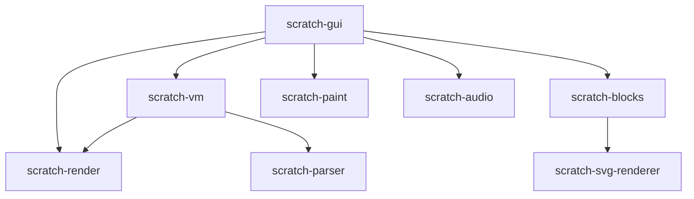

# MistWarp GUI Internals

This section provides comprehensive documentation of MistWarp's GUI architecture, internal systems, and component structure. Whether you're contributing to MistWarp, building addons, or creating custom modifications, this guide will give you deep insight into how everything works.

## Architecture Overview

MistWarp's GUI follows a modern React-based architecture with several key layers:

```
┌─────────────────────────────────────────────┐
│                 React App                   │
├─────────────────────────────────────────────┤
│               Redux Store                   │
│         (State Management)                  │
├─────────────────────────────────────────────┤
│              HOCs & Containers              │
│        (Data Flow & Side Effects)          │
├─────────────────────────────────────────────┤
│             React Components               │
│           (UI & Presentation)              │
├─────────────────────────────────────────────┤
│              Addon System                  │
│        (Extension & Customization)         │
├─────────────────────────────────────────────┤
│             Theme Engine                   │
│          (Styling & Theming)               │
└─────────────────────────────────────────────┘
```

## Core Packages

### Primary Repositories

- **[scratch-gui](https://github.com/MistWarp/scratch-gui)** - Main GUI implementation
- **[scratch-vm](https://github.com/MistWarp/scratch-vm)** - Virtual machine and runtime  
- **[scratch-render](https://github.com/MistWarp/scratch-render)** - Rendering engine
- **[scratch-blocks](https://github.com/MistWarp/scratch-blocks)** - Visual block editor
- **[scratch-paint](https://github.com/MistWarp/scratch-paint)** - Costume/backdrop editor

### Package Dependencies



## File Structure

```
scratch-gui/
├── src/
│   ├── components/          # React UI components
│   ├── containers/          # Redux-connected containers
│   ├── lib/                 # Utility libraries
│   ├── reducers/            # Redux reducers
│   ├── addons/              # Addon system
│   ├── css/                 # Global styles
│   └── index.js             # Entry point
├── static/                  # Static assets
├── test/                    # Test files
└── webpack.config.js        # Build configuration
```

## Key Concepts

### Component Hierarchy

The GUI follows a clear component hierarchy:

1. **App Container** - Root application wrapper
2. **GUI Component** - Main interface layout
3. **Feature Containers** - Blocks, Stage, Sprites, etc.
4. **UI Components** - Buttons, modals, menus, etc.
5. **Addon Components** - Enhanced functionality

### State Management

MistWarp uses Redux for centralized state management:

- **Project State** - Current project, loading status
- **Editor State** - Active tab, selected sprite
- **UI State** - Modal visibility, settings
- **VM State** - Runtime information
- **Addon State** - Addon configurations

### Data Flow

```
User Action → Component → Container → Action → Reducer → Store → Component
```

### Event System

Components communicate through:

- **Redux Actions** - State changes
- **VM Events** - Runtime events  
- **Addon Hooks** - Extension points
- **DOM Events** - User interactions

## Major Systems

### [Core Components](/gui-internals/components/gui-component)
The fundamental UI building blocks including the main GUI component, blocks editor, stage, and sprite management.

### [Containers & HOCs](/gui-internals/containers/overview)
Redux-connected containers and Higher-Order Components that manage data flow and side effects.

### [State Management](/gui-internals/state/redux-store)
Comprehensive Redux store setup, reducers, actions, and middleware for managing application state.

### [Addon System](/gui-internals/addons/home)
Powerful extension system allowing custom functionality, UI modifications, and behavior changes.

### [Theming & Styling](/gui-internals/theming/home)
Dynamic theming system with CSS variables, custom themes, and appearance customization.

### Performance & Optimization
Performance monitoring, optimization techniques, and debugging tools.

## Development Patterns

### Component Design

MistWarp components follow these patterns:

```jsx
// Functional component with hooks
const MyComponent = ({ prop1, prop2 }) => {
    const [state, setState] = useState(initialState);
    
    useEffect(() => {
        // Side effects
    }, [dependencies]);
    
    return (
        <div className={styles.container}>
            {/* JSX content */}
        </div>
    );
};

// Connected container
const MyContainer = connect(
    mapStateToProps,
    mapDispatchToProps
)(MyComponent);
```

### State Management Patterns

```js
// Action creator
const updateSetting = (key, value) => ({
    type: 'UPDATE_SETTING',
    key,
    value
});

// Reducer
const settingsReducer = (state = initialState, action) => {
    switch (action.type) {
        case 'UPDATE_SETTING':
            return {
                ...state,
                [action.key]: action.value
            };
        default:
            return state;
    }
};
```

### Addon Integration

```js
// Addon API usage
export default class MyAddon {
    onEnable() {
        this.addButton();
        this.addCSS();
    }
    
    addButton() {
        const button = document.createElement('button');
        this.addon.tab.appendToSharedSpace({
            space: 'stageHeader',
            element: button,
            order: 1
        });
    }
}
```

## Build System

### Webpack Configuration

MistWarp uses a sophisticated Webpack setup:

- **Development Server** - Hot reloading, source maps
- **Production Build** - Minification, optimization  
- **Addon Processing** - Dynamic addon loading
- **Asset Management** - Images, fonts, CSS

### Key Build Features

- **Code Splitting** - Reduced bundle sizes
- **Tree Shaking** - Dead code elimination
- **Hot Module Replacement** - Fast development
- **CSS Processing** - PostCSS, autoprefixing
- **SVG Optimization** - Compressed vector graphics

## Testing Strategy

### Test Types

1. **Unit Tests** - Individual component testing
2. **Integration Tests** - Component interaction testing
3. **E2E Tests** - Full user workflow testing
4. **Performance Tests** - Render and runtime performance

### Testing Tools

- **Jest** - Test runner and assertions
- **React Testing Library** - Component testing
- **Puppeteer** - E2E testing
- **Lighthouse** - Performance auditing

## Debugging Tools

### Built-in Debugging

- **Redux DevTools** - State inspection
- **React DevTools** - Component tree inspection
- **Performance Profiler** - Runtime performance analysis
- **Addon Developer Tools** - Addon debugging utilities

### Development Helpers

```js
// Debug utilities
window.vm // Access to VM instance
window.reduxStore // Access to Redux store  
window.scratchGui // GUI utilities
window.addons // Addon system access
```

## Contributing Guidelines

### Code Standards

- **ESLint** - Code quality enforcement
- **Prettier** - Code formatting
- **JSDoc** - Documentation comments
- **PropTypes** - Component prop validation

### Git Workflow

1. **Fork repository**
2. **Create feature branch**
3. **Make changes with tests**
4. **Submit pull request**
5. **Pass CI checks**
6. **Code review process**

## Getting Started with Internals

### For Addon Developers
Start with [Addon System Overview](/gui-internals/addons/home) to understand how to extend MistWarp's functionality.

### For Contributors
Begin with [Architecture Guide](/gui-internals/architecture) to understand the overall system design.

### For Theme Developers
Explore [Theming System](/gui-internals/theming/home) to learn about customizing MistWarp's appearance.

### For Performance Engineers
Learn optimization techniques and monitoring tools for improving MistWarp performance.

---

*This documentation is continuously updated as MistWarp evolves. For the latest information, always refer to the source code and Git history.*
